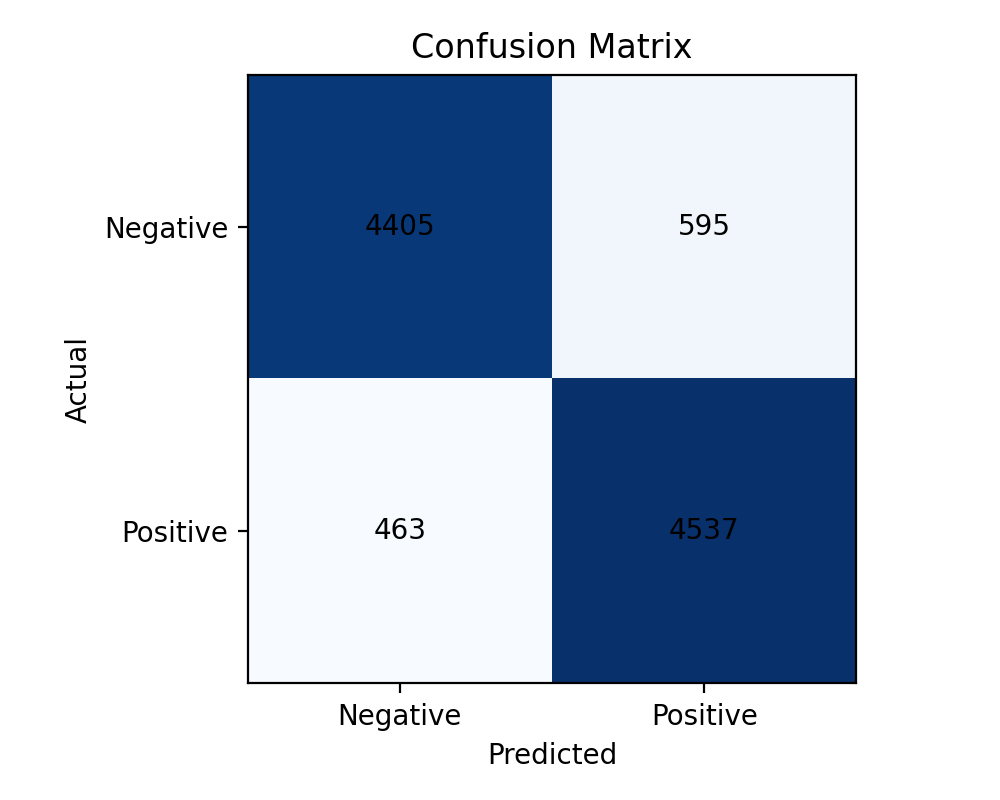

# Aletheia

Aletheia is a sentiment analysis classifier that reads between the lines — trained on 50,000 movie reviews to tell you exactly how something feels.

## What it does
- Accepts raw text and predicts whether the sentiment is Positive or Negative.
- Returns a confidence percentage and a simple visual indicator.

🔗 **[Live Demo](#)** — *(link added after deployment)*

## Tech stack
- Python
- scikit-learn (TF-IDF + Logistic Regression)
- Hugging Face `datasets` (IMDB)
- Streamlit (web app)
- joblib (model persistence)
- pandas, numpy, matplotlib

## How to run locally
1. Create and activate a virtual environment (optional but recommended):

```bash
python -m venv .venv
.
# on Windows (PowerShell)
.\.venv\Scripts\Activate.ps1
# on macOS / Linux
source .venv/bin/activate
```

2. Install dependencies:

```bash
pip install -r requirements.txt
```

3. Train the model (this downloads the IMDB dataset):

```bash
python src/sentiment_analyzer/train.py
```

4. Run the Streamlit app:

```bash
streamlit run app/app.py
```

The trained model will be saved to `models/sentiment_model.joblib` and a confusion matrix will be written to `reports/figures/`.

## Results
| Metric | Score |
|--------|-------|
| Accuracy | 89.4% |
| F1 Score | 0.90 |

